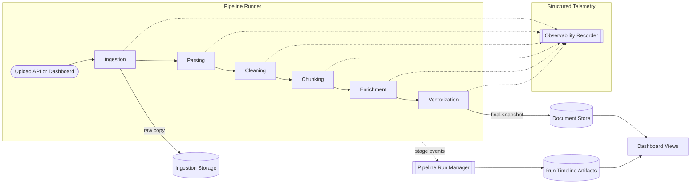

# Document Parsing Pipeline for RAG

This repository contains a FastAPI application that ingests office documents, runs them through a deterministic document-processing pipeline, and surfaces the intermediate artifacts for Retrieval Augmented Generation (RAG) workflows. The codebase is intentionally modular: domain models capture immutable document state, services orchestrate pipeline stages, ports expose the seams for adapters, and a dashboard makes every stage observable.

---

## Pipeline Overview

The pipeline executes the following stages in order. Each service returns a new `Document` instance and emits structured telemetry through the `ObservabilityRecorder` port.

| Stage | Service (`src/app/services`) | Resulting `Document.status` | Key Outputs |
| --- | --- | --- | --- |
| Ingestion | `IngestionService` | `ingested` | Copies raw bytes to `artifacts/ingestion/<document_id>/`, records checksum + content metadata |
| Parsing | `ParsingService` | `parsed` | Uses vision LLM via `ImageAwareParsingAdapter` to extract structured content from 300 DPI page images. Produces `ParsedPage` components (text, tables, images) with table summaries and page summaries. Stores pixmaps under `artifacts/pixmaps/` |
| Cleaning | `CleaningService` | `cleaned` | Uses `CleaningAdapter` (LlamaIndex text LLM) to normalize parsed content, flag segments for review, and generate cleaned text per page stored in `cleaning_metadata_by_page` |
| Chunking | `ChunkingService` | `chunked` | Supports three strategies: `component` (preserves table/image boundaries), `hybrid`, or `fixed` (legacy overlap). Attaches component metadata (type, summary, description) to each chunk |
| Enrichment | `EnrichmentService` | `enriched` | Uses `LlamaIndexSummaryAdapter` to generate document-level summary from page summaries, then creates contextualized text for each chunk following Anthropic's contextual retrieval pattern |
| Vectorization | `VectorService` | `vectorized` | Embeds `contextualized_text` (not raw text) via `LlamaIndexEmbeddingAdapter`, preserving both context-enriched and original text for retrieval and generation |

`PipelineRunner` coordinates these services, records per-stage duration/details, and `PipelineRunManager` persists progress snapshots so the dashboard can stream updates while a run is executing asynchronously.

### Visual Pipeline Flow



_Figure 1: End-to-end pipeline flow showing how uploads move through services, storage targets, observability, and dashboard-facing artifacts._

---

## Repository Structure

```
RAG_pipeline_worker/
├── AGENTS.md
├── README.md
├── requirements.txt
├── artifacts/                 # File-system persistence targets (configurable via env vars)
│   ├── documents/
│   ├── ingestion/
│   └── runs/
├── docs/
│   ├── ARCHITECTURE.md
│   ├── Pipeline_Quick_Reference.md
│   ├── Pipeline_Data_Flow_and_Observability_Report.md
│   ├── LLM_Integration_Implementation_Guide.md
│   ├── Observability_Integration_TODO.md
│   ├── prompts/                    # LLM prompt templates
│   │   ├── parsing/
│   │   ├── cleaning/
│   │   └── summarization/
│   └── research/
│       └── README.md
├── src/
│   └── app/
│       ├── api/
│       │   ├── dashboard.py            # Manual QA dashboard + upload form
│       │   ├── routers.py              # REST API (upload/list/get)
│       │   ├── task_scheduler.py       # BackgroundTasks adapter
│       │   └── templates/
│       ├── adapters/                   # LlamaIndex-based LLM adapters
│       │   ├── llama_index/            # Vision parsing, cleaning, summarization, embeddings
│       │   └── legacy parsers/         # PDF/DOCX/PPT fallback parsers
│       ├── application/
│       │   ├── interfaces.py           # Ports (DocumentParser, SummaryGenerator, ObservabilityRecorder, TaskScheduler)
│       │   └── use_cases/              # Upload/List/Get use cases
│       ├── config.py
│       ├── container.py                # Composition root wiring concrete adapters
│       ├── domain/                     # Immutable models + pipeline run dataclasses
│       ├── observability/              # LoggingObservabilityRecorder adapter
│       ├── persistence/                # Repository ports + filesystem adapters
│       ├── services/                   # Pipeline stage implementations
│       └── main.py                     # FastAPI entry point
├── static/
│   └── uploads/                        # Dashboard document previews
├── tests/
│   ├── test_architecture.py            # Import guardrails (hexagonal compliance)
│   ├── test_dashboard.py               # Dashboard flow and background runs
│   ├── test_end_to_end.py              # Upload/list/get API round-trip
│   ├── test_pdf_parser.py              # pdfplumber adapter tests
│   ├── test_persistence_filesystem.py  # Repository adapters
│   ├── test_run_manager.py
│   ├── test_services.py
│   └── test_use_cases.py
└── tmp/                                # Scratch space for manual experiments
```

---

## Core Modules

- **Domain models (`src/app/domain`)** – `Document`, `Page`, `Chunk`, and `Metadata` capture every transformation applied to an upload. Helper methods like `add_page` and `add_chunk` always return copies, preserving immutability.
- **Application layer (`src/app/application`)** – Protocols in `interfaces.py` define ports for document parsers, summary generators, schedulers, and observability recorders. Use cases (Upload/List/Get) translate HTTP concerns into pipeline invocations.
- **Services (`src/app/services`)** – Each class encapsulates one stage of the pipeline and depends strictly on domain models + ports. `PipelineRunner` strings the stages together, and `PipelineRunManager` handles persistence plus async execution via the injected `TaskScheduler`.
- **Adapters (`src/app/adapters`)** – Contain infrastructure-specific code wrapped around LlamaIndex:
  - `ImageAwareParsingAdapter` wraps OpenAI vision LLM for multi-modal parsing with structured output
  - `CleaningAdapter` uses LlamaIndex LLM for text normalization and segment flagging
  - `LlamaIndexSummaryAdapter` generates LLM-based summaries for chunks and documents
  - `LlamaIndexEmbeddingAdapter` creates embeddings via LlamaIndex settings
  - Legacy parsers (`PdfParserAdapter`, `DocxParserAdapter`, `PptParserAdapter`) remain for fallback scenarios
  
  All LlamaIndex imports stay confined to adapters, keeping services framework-agnostic.
- **Persistence (`src/app/persistence`)** – Defines repository ports plus filesystem-backed adapters:
  - `FileSystemIngestionRepository` stores raw uploads;
  - `FileSystemDocumentRepository` persists processed `Document` snapshots;
  - `FileSystemPipelineRunRepository` captures per-stage JSON artifacts for the dashboard.
- **Observability (`src/app/observability/logger.py`)** – Default adapter that writes structured JSON payloads to Python logging. Inject a different `ObservabilityRecorder` to push traces elsewhere.
- **Composition (`src/app/container.py`)** – Centralizes dependency injection, reads environment variables (`RUN_ARTIFACTS_DIR`, `INGESTION_STORAGE_DIR`, `DOCUMENT_STORAGE_DIR`, `PIPELINE_STAGE_LATENCY`), and exposes fully-wired use cases to the FastAPI routes.

---

## FastAPI Surface

- `POST /upload` – Accepts a single file and processes it synchronously by calling `UploadDocumentUseCase`. Returns the final `Document` with pages, chunks, metadata, and vectors.
- `GET /documents` – Lists all stored documents via `ListDocumentsUseCase`.
- `GET /documents/{doc_id}` – Fetches a single processed document.
- `GET /dashboard` – Renders the manual test harness with real-time pipeline monitoring:
  - Upload documents and track processing through all stages
  - Background execution via `PipelineRunManager.run_async` with live polling
  - View parsed components (tables, images, text) with summaries
  - Inspect chunk metadata including component type and contextualized text
  - Track stage durations and component-aware chunking statistics
  - Preview document files served from `static/uploads/`

The dashboard uses only server-side templates (Jinja2) plus vanilla JS for auto-refreshing. No frontend build tooling required.

---

## Data & Artifacts

All persistence paths default to the `artifacts/` directory inside the repo but can be overridden via environment variables:

- `RUN_ARTIFACTS_DIR` → timeline JSON for each pipeline run (consumed by the dashboard)
- `INGESTION_STORAGE_DIR` → immutable upload copies + checksums
- `DOCUMENT_STORAGE_DIR` → processed document snapshots read by the API/use cases
- `PIXMAP_STORAGE_DIR` → 300 DPI page images (`artifacts/pixmaps/<document_id>/page_N.png`)
- `PIPELINE_STAGE_LATENCY` → optional float (seconds) used to simulate slow stages and make dashboard updates easier to see

The dashboard stores uploaded files under `static/uploads/` for inline previews. Pixmaps are generated during parsing for vision LLM input and stored for traceability. Clean up the `artifacts/` and `static/uploads/` directories periodically during local development if disk space becomes an issue.

---

## Configuration

`src/app/config.py` exposes typed configuration models for every integration point (LLM, embeddings, chunking, vector stores, and prompt files). Override values via environment variables or a local `.env` file using Pydantic's nested syntax. 

### Key Configuration Options

```bash
# LLM Settings
LLM__PROVIDER=openai
LLM__MODEL=gpt-4o-mini
LLM__USE_STRUCTURED_OUTPUTS=true  # Use native JSON mode for reliability
LLM__USE_STREAMING=false          # Disable for structured outputs

# Chunking Strategy (NEW in llama-index branch)
CHUNKING__STRATEGY=component           # "component", "hybrid", or "fixed"
CHUNKING__COMPONENT_MERGE_THRESHOLD=100  # Min tokens to merge small components
CHUNKING__MAX_COMPONENT_TOKENS=500      # Max tokens before splitting large components
CHUNKING__CHUNK_SIZE=512               # Used by fixed/hybrid strategies
CHUNKING__CHUNK_OVERLAP=50

# Pipeline Features
USE_VISION_CLEANING=false    # Enable vision-based cleaning (optional)
USE_LLM_SUMMARIZATION=true   # Use LLM for summaries (vs truncation)
CHUNKING__INCLUDE_IMAGES=true  # Generate 300 DPI pixmaps for parsing

# Vector Store
VECTOR_STORE__PERSIST_DIR=artifacts/vector_store_dev
```

**Component-Aware Chunking:** The `component` strategy (default) preserves document structure by keeping tables, images, and text blocks intact. This enables downstream RAG systems to filter by component type and provides better semantic boundaries than fixed-size chunking.

**Structured Outputs:** The parsing and cleaning stages use LlamaIndex's `as_structured_llm()` API with native JSON mode for reliable structured output extraction. Streaming can be enabled for observability at the cost of disabling native structured output.

Install the required LlamaIndex extras before running the app (at minimum `pip install llama-index-core llama-index-llms-openai llama-index-embeddings-openai`). The bootstrapper (`src/app/adapters/llama_index/bootstrap.py`) wires these settings into `llama_index.core.Settings` during startup, keeping framework imports confined to the adapters layer.

### API Keys & Environment Secrets

LLM calls require provider-specific API keys. During local development add the keys to your `.env` file so `pydantic-settings` can load them automatically:

```bash
cp .env.example .env
echo "LLM__API_KEY=sk-your-key" >> .env
echo "OPENAI_API_KEY=sk-your-key" >> .env  # optional fallback for SDKs
echo "LLM__PROVIDER=openai" >> .env
echo "LLM__MODEL=gpt-4o-mini" >> .env
```

> **403 model_not_found?** This happens when the configured key lacks access to the model (`gpt-4o-mini` in the default config). Either request access to the model or change `LLM__MODEL` to one that your account can use (e.g., `gpt-4o-mini-2024-07-18` or another SKU) and restart the server.
>
> **401 missing API key?** Make sure either `LLM__API_KEY` or `OPENAI_API_KEY` is set in the environment. The code first checks `LLM__API_KEY` and falls back to `OPENAI_API_KEY`; if both are blank the OpenAI SDK will reject requests with a 401.

In hosted environments (Render, AWS, etc.) define the same variables through your platform’s secrets manager (`OPENAI_API_KEY`, `LLM__PROVIDER`, `LLM__MODEL`, etc.). The application reads everything from environment variables, so no code changes are required to swap providers or models.

---

## Getting Started

### Quick Start for New Developers

**Understanding the Pipeline (5 min read):**

1. Read the [Pipeline Quick Reference](docs/Pipeline_Quick_Reference.md) for data flow and storage locations
2. Review [ARCHITECTURE.md](docs/ARCHITECTURE.md) for hexagonal architecture principles
3. Check [Pipeline Data Flow Report](docs/Pipeline_Data_Flow_and_Observability_Report.md) for comprehensive deep dive

**Making Your First Change:**

1. **Modify a prompt**: Edit `docs/prompts/parsing/system.md` to change LLM behavior
2. **Test via dashboard**: Visit `http://localhost:8000/dashboard` and upload a test document
3. **Check the output**: Inspect `artifacts/documents/{doc_id}.json` for the results

**Common Tasks:**

- **Add a new pipeline stage**: See `ARCHITECTURE.md` § "When Adding a New Service"
- **Tune LLM behavior**: See `docs/prompts/README.md` for prompt engineering guide
- **Debug a parsing issue**: See `Pipeline_Quick_Reference.md` § "Debug Workflow"
- **Change chunking strategy**: Set `CHUNKING__STRATEGY=component` (or `hybrid`/`fixed`) in `.env`

---

### Install Dependencies

This project now targets **Python 3.10+** so we can rely on modern typing syntax (`str | None`, `list[str]`, etc.). Recreate your virtualenv with a 3.10 interpreter (or higher) before installing dependencies:

```bash
rm -rf .venv                   # optional: only if you are upgrading
python3.10 -m venv .venv
source .venv/bin/activate
pip install --upgrade pip
pip install -r requirements.txt
```

> `.env` loading uses [`python-dotenv`](https://pypi.org/project/python-dotenv/). Make sure your virtualenv has the updated dependencies (`pip install -r requirements.txt`) so the loader can pull API keys from `.env` automatically.

### Contract Tests

Live API contract tests are kept in `tests_contracts/` and are **not** run with the standard `pytest` command. To execute them explicitly (and incur API usage), run:

```bash
RUN_CONTRACT_TESTS=1 pytest tests_contracts
```

Ensure your `.env` (or environment) contains the necessary keys before running these tests.

> Tip: The `contract` pytest mark is registered in `pytest.ini`, so you can also run `pytest -m contract` if you want to focus only on the live integration suite.
If your system default `python3` already points to 3.10+, feel free to substitute it for `python3.10`.

### Run the API + Dashboard

```bash
PIPELINE_STAGE_LATENCY=0.05 uvicorn src.app.main:app --reload
```

- Visit `http://localhost:8000/docs` for the OpenAPI explorer.
- Visit `http://localhost:8000/dashboard` to run the manual QA workflow. Upload `tests/test_document.pdf` to see every stage artifact, chunk breakdown, and duration metadata.

### Run the Tests

```bash
pytest              # full suite
pytest tests/test_architecture.py  # enforce hexagonal import rules
```

- `tests/test_services.py` covers every pipeline stage plus immutability guarantees.
- `tests/test_dashboard.py` exercises the background-run workflow.
- `tests/test_pdf_parser.py` asserts that `pdfplumber` parsing works and errors are handled gracefully.

---

## Working Guidelines

- Keep the hexagonal boundaries intact: domain models never import adapters, services depend only on ports, and adapters hook into protocols defined under `application/interfaces.py`.
- Preserve immutability by returning new model instances (`model_copy`) from services, and mirror this in tests whenever new behavior is introduced.
- When adding new adapters or services, wire them through `container.py`, emit observability events, and update the relevant documentation under `docs/`.
- Architecture tests (`tests/test_architecture.py`) must stay green before merging any change.

---

## Documentation

### For New Developers
- [README](README.md) - Start here for setup and overview (you are here)
- [Quick Reference](docs/Pipeline_Quick_Reference.md) - Data flow cheat sheet and common operations
- [Architecture Guide](docs/ARCHITECTURE.md) - Hexagonal patterns and best practices

### Deep Dives
- [LLM Integration Patterns](docs/LLM_Integration_Patterns.md) - **NEW!** Complete guide to LLM usage throughout pipeline with architecture patterns and data flow diagram
- [Pipeline Data Flow Report](docs/Pipeline_Data_Flow_and_Observability_Report.md) - Comprehensive stage-by-stage analysis
- [LLM Integration Guide](docs/LLM_Integration_Implementation_Guide.md) - Technical implementation details for LlamaIndex adapters

### Implementation Records
- [Pipeline Improvements Status](docs/Pipeline_Improvements_Implementation_Status.md) - Component-aware chunking and contextual retrieval implementation
- [Structured Output Summary](docs/Structured_Output_Implementation_Summary.md) - LlamaIndex best practices for reliable JSON extraction

### Next Steps
- [Observability TODO](docs/Observability_Integration_TODO.md) - Langfuse tracing and Ragas evaluation integration plan

### Prompts & Research
- [Prompts Guide](docs/prompts/README.md) - How to tune LLM behavior across pipeline stages
- [Research](docs/research/) - LlamaIndex API research and integration patterns

### Agent Workflow
- [AGENTS.md](AGENTS.md) - Specification-driven development workflow for research → planning → implementation
