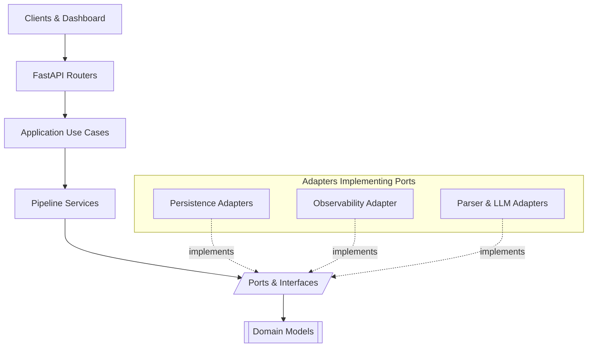

# Architecture Guide

This document describes the hexagonal architecture patterns used in this codebase and provides guidance for developers.

## Table of Contents

1. [Architecture Overview](#architecture-overview)
2. [Layer Structure](#layer-structure)
3. [Dependency Flow](#dependency-flow)
4. [Key Patterns](#key-patterns)
5. [Immutability](#immutability)
6. [Dependency Injection](#dependency-injection)
7. [Use Cases](#use-cases)
8. [Testing Strategy](#testing-strategy)

---

## Architecture Overview

This codebase follows **Hexagonal Architecture** (also known as Ports and Adapters), which separates business logic from infrastructure concerns. The architecture ensures:

- **Domain independence**: Business logic doesn't depend on external frameworks or libraries
- **Testability**: Each layer can be tested in isolation
- **Flexibility**: Adapters can be swapped without changing business logic
- **Maintainability**: Clear separation of concerns

---

## Layer Structure

```
src/app/
├── domain/              # Core business logic (innermost layer)
│   ├── models.py        # Domain entities (Document, Page, Chunk, Metadata)
│   └── run_models.py    # Pipeline execution models
│
├── application/         # Application interfaces and use cases
│   ├── interfaces.py    # Protocol definitions (ports)
│   └── use_cases/       # Use case implementations
│       ├── upload_document_use_case.py
│       ├── list_documents_use_case.py
│       └── get_document_use_case.py
│
├── services/            # Application services (orchestration)
│   ├── ingestion_service.py
│   ├── parsing_service.py
│   ├── cleaning_service.py
│   ├── chunking_service.py
│   ├── enrichment_service.py
│   ├── vector_service.py
│   ├── pipeline_runner.py
│   └── run_manager.py
│
├── adapters/            # Primary adapters (LLM-powered via LlamaIndex)
│   ├── llama_index/     # LlamaIndex-based adapters
│   │   ├── bootstrap.py           # LlamaIndex configuration
│   │   ├── parsing_adapter.py     # ImageAwareParsingAdapter (vision LLM)
│   │   ├── cleaning_adapter.py    # CleaningAdapter (text LLM)
│   │   ├── summary_adapter.py     # LlamaIndexSummaryAdapter
│   │   └── embedding_adapter.py   # LlamaIndexEmbeddingAdapter
│   ├── pdf_parser.py    # Legacy fallback parsers
│   ├── docx_parser.py
│   └── ppt_parser.py
│
├── persistence/         # Secondary adapters (repositories)
│   ├── ports.py         # Repository interfaces
│   └── adapters/        # Concrete implementations
│       ├── filesystem.py
│       ├── document_filesystem.py
│       └── ingestion_filesystem.py
│
├── observability/       # Observability adapters
│   └── logger.py        # LoggingObservabilityRecorder
│
├── api/                 # Web framework adapters (FastAPI)
│   ├── routers.py
│   ├── dashboard.py
│   ├── task_scheduler.py
│   └── templates/
│       ├── base.html
│       ├── dashboard.html
│       └── partials/run_details.html
│
└── container.py         # Composition root (dependency injection)
```

---

## Dependency Flow

The dependency direction follows this rule: **dependencies point inward**.

```
API Layer
    ↓
Use Cases
    ↓
Services
    ↓
Application Interfaces (Ports)
    ↓
Domain Models
```

**Key Rules:**

1. **Domain layer** must not import from any other layer
   - Only standard library and pydantic allowed
   - No infrastructure dependencies

2. **Services** can import from:
   - Domain models
   - Application interfaces (ports)
   - Persistence ports (repository interfaces)
   - Other services (for orchestration)

3. **Adapters** implement ports defined in `application/interfaces.py`
   - They can import domain models
   - They cannot be imported by services directly

4. **API layer** uses use cases, not services directly
   - Keeps HTTP concerns separate from business logic

### Layer Interaction Diagram



_Figure 2: Hexagonal layering—requests travel downward through application layers while adapters in the outer ring implement the inward-facing ports._

---

## Pipeline Services at a Glance

| Stage | Class | Description | Status & Telemetry |
| --- | --- | --- | --- |
| Ingestion | `IngestionService` | Records the upload event, persists raw bytes through the `IngestionRepository`, computes checksum, and stamps `ingested_at`. | Sets `Document.status = "ingested"` and emits `stage="ingestion"` events containing filename, type, and size. |
| Parsing | `ParsingService` | Renders 300 DPI page pixmaps via `PixmapFactory`, then invokes `ImageAwareParsingAdapter` (vision LLM) to extract structured components (text, tables, images). Produces `ParsedPage` with table summaries, page summaries, and component metadata. Stores pixmaps under `artifacts/pixmaps/`. | Sets status to `"parsed"` and reports parsed component count, pixmap generation metrics, and LLM latency. |
| Cleaning | `CleaningService` | Invokes `CleaningAdapter` (LlamaIndex text LLM) with parsed components. Normalizes text, flags segments for review (`needs_review`), and generates cleaned text per page. Optionally uses vision for layout-aware cleaning. | Sets status to `"cleaned"` and reports segment count, flagged segments, and cleaning metadata stored in `cleaning_metadata_by_page`. |
| Chunking | `ChunkingService` | Supports three strategies: `component` (preserves table/image boundaries), `hybrid`, or `fixed` (legacy overlap). Component strategy groups small components and splits large ones. Attaches component metadata (type, order, summary, description) to chunks. | Sets status to `"chunked"` and reports strategy used, component grouping stats, and chunk count per component type. |
| Enrichment | `EnrichmentService` | Generates document-level summary from page summaries via `LlamaIndexSummaryAdapter`. Creates contextualized text for each chunk using Anthropic's contextual retrieval pattern: `[Document: X \| Page: Y \| Section: Z \| Type: T]\n\nchunk_text`. | Sets status to `"enriched"` and reports document summary generation, chunk summaries, and contextualized text creation metrics. |
| Vectorization | `VectorService` | Embeds `contextualized_text` (not raw text) via `LlamaIndexEmbeddingAdapter`. Preserves both context-enriched text for retrieval and original cleaned text for generation. Stores vectors in `chunk.metadata.extra.vector`. | Sets status to `"vectorized"` and reports embedding dimension, count of chunks using contextualized text, and sample vectors. |

`PipelineRunner` executes these services sequentially, captures duration/metadata per stage, and hands the `PipelineResult` to `PipelineRunManager`. The run manager snapshots stage output via `PipelineRunRepository`, allowing the dashboard to show incremental progress while background work runs via the `TaskScheduler` port.

---

## Ports and Adapters in this Release

### LlamaIndex-Powered Adapters

- **ParsingLLM (ImageAwareParsingAdapter)** → Wraps OpenAI vision LLM via LlamaIndex `OpenAIMultiModal`. Accepts 300 DPI pixmaps and produces structured `ParsedPage` output using `as_structured_llm()` for reliable JSON extraction. Loads prompts from `docs/prompts/parsing/`. Supports streaming for observability or native JSON mode for reliability.

- **CleaningLLM (CleaningAdapter)** → Uses LlamaIndex text LLM with `as_structured_llm(CleanedPage)` to normalize parsed content, flag segments for human review, and generate cleaned text. Optionally accepts pixmap paths for vision-based cleaning.

- **SummaryGenerator (LlamaIndexSummaryAdapter)** → Generates LLM-based summaries for chunks and documents. Uses prompts from `docs/prompts/summarization/`. Returns plain text summaries (2-3 sentences per chunk, 3-4 sentences per document).

- **EmbeddingGenerator (LlamaIndexEmbeddingAdapter)** → Delegates to LlamaIndex's configured embedding model (via `llama_index.core.Settings`). Embeds contextualized text for improved retrieval performance.

### Legacy Adapters

- **DocumentParser** → Implemented by `PdfParserAdapter`, `DocxParserAdapter`, and `PptParserAdapter`. Used as fallback when vision LLM parsing fails or is disabled. Only the PDF adapter talks to `pdfplumber`.

### Infrastructure Adapters

- **ObservabilityRecorder** → `LoggingObservabilityRecorder` bridges to Python logging and outputs JSON payloads per stage. Tests often rely on `NullObservabilityRecorder` or bespoke stubs to assert emitted events.
- **TaskScheduler** → `BackgroundTaskScheduler` wraps FastAPI's `BackgroundTasks` so `PipelineRunManager` can execute long-running work asynchronously from dashboard requests.
- **Repositories** → `FileSystemIngestionRepository`, `FileSystemDocumentRepository`, and `FileSystemPipelineRunRepository` implement the storage ports declared under `src/app/persistence/ports.py`. They insulate services/use cases from persistence concerns.

Every adapter is wired exclusively inside `src/app/container.py`, which becomes the single place to configure environment-driven overrides (custom storage paths, alternate observability adapters, new parsers, LLM providers, etc.).

---

## Persistence & Run Tracking

- Raw uploads land in `artifacts/ingestion/<document_id>/` with timestamped filenames and SHA-256 checksums. The ingestion stage stores the on-disk path inside `Document.metadata["raw_file_path"]` to support delayed parsing.
- Processed `Document` snapshots live under `artifacts/documents/` and are loaded by the `/documents` API endpoints. These files drive the public interface for clients/tests.
- Pipeline run metadata is written to `artifacts/runs/<run_id>/`, where `run.json` tracks status + stage order, `document.json` stores the latest document snapshot, and `stages/*.json` contains the payload for each service. The dashboard renders these files verbatim.
- Each directory can be overridden through environment variables (`INGESTION_STORAGE_DIR`, `DOCUMENT_STORAGE_DIR`, `RUN_ARTIFACTS_DIR`) so deployments can point at shared volumes or cloud buckets without code changes.

---

## FastAPI Entry Points & Background Work

- REST routes in `api/routers.py` depend only on use cases, keeping HTTP validation separate from business logic.
- The dashboard routes (`api/dashboard.py`) provide a manual QA harness: uploads kick off `PipelineRunManager.run_async`, and a lightweight polling loop fetches run fragments while background tasks finalize the pipeline.
- `api/task_scheduler.py` adapts FastAPI's `BackgroundTasks` to the `TaskScheduler` port so orchestration logic stays framework-agnostic.
- Static assets (document previews) are served from `static/uploads/`, and templates under `api/templates/` render run details, stage cards, and histories with zero frontend build tooling.

---

## Key Patterns

### Ports and Adapters

**Ports** are interfaces defined in `application/interfaces.py`:

```python
class DocumentParser(Protocol):
    """Port for file-type specific document parsers."""
    supported_types: Sequence[str]
    def supports_type(self, file_type: str) -> bool: ...
    def parse(self, file_bytes: bytes, filename: str) -> list[str]: ...
```

**Adapters** implement these ports:

```python
class PdfParserAdapter(DocumentParser):
    """Concrete adapter implementing PDF parsing."""
    supported_types: Sequence[str] = ("pdf",)
    def supports_type(self, file_type: str) -> bool: ...
    def parse(self, file_bytes: bytes, filename: str) -> list[str]: ...
```

### Composition Root

All dependencies are wired in `container.py`:

```python
class AppContainer:
    def __init__(self):
        # Wire adapters
        self.observability = LoggingObservabilityRecorder()
        
        # Wire services with dependencies
        self.ingestion_service = IngestionService(
            repository=self.ingestion_repository,
            observability=self.observability,
        )
        
        # Wire use cases
        self.upload_document_use_case = UploadDocumentUseCase(
            runner=self.pipeline_runner,
            repository=self.document_repository,
        )
```

---

## Immutability

All domain models and service methods follow **immutability patterns**:

### Domain Models

Domain models return new instances instead of mutating:

```python
# Before (mutation - WRONG)
def add_page(self, page: Page) -> Page:
    self.pages.append(page)  # Mutates self
    return page

# After (immutability - CORRECT)
def add_page(self, page: Page) -> Document:
    updated_pages = [*self.pages, page]
    return self.model_copy(update={"pages": updated_pages})
```

### Services

Services return new Document instances:

```python
# Before (mutation - WRONG)
def clean(self, document: Document) -> Document:
    document.status = "cleaned"  # Mutates input
    return document

# After (immutability - CORRECT)
def clean(self, document: Document) -> Document:
    return document.model_copy(update={"status": "cleaned"})
```

### Benefits

- **Predictable behavior**: Original objects remain unchanged
- **Easier testing**: Can verify original state is preserved
- **Thread safety**: No shared mutable state
- **Debugging**: Clear state transitions

---

## Dependency Injection

All services accept dependencies via constructor injection:

```python
class IngestionService:
    def __init__(
        self,
        latency: float = 0.0,
        repository: IngestionRepository | None = None,
        observability: ObservabilityRecorder,  # Required, no default
    ) -> None:
        self.repository = repository
        self.observability = observability
```

**Key Principles:**

1. **No concrete imports in services**: Services only import interfaces
2. **Required dependencies**: No `None` defaults for critical dependencies
3. **Container provides defaults**: `AppContainer` wires all dependencies
4. **Testability**: Easy to inject mocks/stubs in tests

### Example: Testing with Mocks

```python
def test_service_uses_injected_dependency():
    mock_recorder = StubObservabilityRecorder()
    service = IngestionService(observability=mock_recorder)
    # Service uses mock_recorder, not a concrete implementation
```

---

## Use Cases

Use cases encapsulate business logic and orchestration:

```python
class UploadDocumentUseCase:
    def __init__(self, runner: PipelineRunner, repository: DocumentRepository):
        self.runner = runner
        self.repository = repository
    
    def execute(self, filename: str, file_type: str, file_bytes: bytes) -> Document:
        # Validation
        if not filename:
            raise HTTPException(status_code=400, detail="Filename is required")
        
        # Business logic
        document = Document(...)
        result = self.runner.run(document, file_bytes=file_bytes)
        
        # Persistence
        self.repository.save(result.document)
        return result.document
```

**Benefits:**

- **Separation of concerns**: API layer doesn't contain business logic
- **Reusability**: Use cases can be called from different entry points
- **Testability**: Easy to test business logic in isolation
- **Single responsibility**: Each use case handles one operation

---

## Testing Strategy

### Unit Tests

Test each service in isolation with mocked dependencies:

```python
def test_ingestion_returns_new_instance():
    service = IngestionService(observability=NullObservabilityRecorder())
    original = build_document()
    result = service.ingest(original)
    assert result is not original  # Immutability check
```

### Integration Tests

Test use cases with real adapters:

```python
def test_upload_use_case_processes_document(tmp_path):
    repository = FileSystemDocumentRepository(tmp_path)
    use_case = UploadDocumentUseCase(runner=runner, repository=repository)
    document = use_case.execute("test.pdf", "pdf", b"content")
    assert document.status == "vectorized"
```

### Architecture Tests

Verify dependency flow and import rules:

```python
def test_domain_layer_has_no_infrastructure_imports():
    # Verifies domain only imports stdlib + pydantic
    ...

def test_services_dont_import_concrete_adapters():
    # Verifies services only import interfaces
    ...
```

---

## Best Practices

### When Adding a New Service

1. Define the port in `application/interfaces.py` if it needs an adapter
2. Create the service in `services/` with dependency injection
3. Make it return new instances (immutability)
4. Wire it in `container.py`
5. Write tests with mocked dependencies

### When Adding a New Adapter

1. Implement the port from `application/interfaces.py`
2. Place it in the appropriate adapter directory
3. Wire it in `container.py`
4. Write adapter-specific tests

### When Adding a New Use Case

1. Create the use case in `application/use_cases/`
2. Inject required services/repositories
3. Handle validation and error cases
4. Wire it in `container.py`
5. Write use case tests

### When Modifying Domain Models

1. Keep models immutable (use `model_copy()`)
2. Don't add infrastructure dependencies
3. Update all services that use the model
4. Update tests

---

## Common Pitfalls to Avoid

1. **Importing concrete adapters in services**
   - ❌ `from ..adapters.pdf_parser import PdfParserAdapter`
   - ✅ `from ..application.interfaces import DocumentParser`

2. **Mutating domain models**
   - ❌ `document.status = "cleaned"`
   - ✅ `return document.model_copy(update={"status": "cleaned"})`

3. **Business logic in API layer**
   - ❌ Validation and orchestration in route handlers
   - ✅ Use cases handle business logic

4. **Domain depending on infrastructure**
   - ❌ Domain models importing FastAPI, databases, etc.
   - ✅ Domain only imports stdlib + pydantic

---

## LlamaIndex Integration

### Configuration and Bootstrap

The pipeline uses LlamaIndex for all LLM-powered operations. Configuration happens in two layers:

1. **Config Models (`src/app/config.py`)**: Typed settings for LLM provider, model, temperature, structured output options, chunking strategy, embedding model, etc.

2. **Bootstrap (`src/app/adapters/llama_index/bootstrap.py`)**: Wires config into `llama_index.core.Settings` at startup, ensuring all LlamaIndex-powered adapters share the same configuration.

```python
# Example: How bootstrap configures LlamaIndex
from llama_index.core import Settings
from llama_index.llms.openai import OpenAI

def configure_llama_index(config: Settings):
    Settings.llm = OpenAI(
        model=config.llm.model,
        temperature=config.llm.temperature,
        api_key=config.llm.api_key
    )
    Settings.embed_model = OpenAIEmbedding(
        model=config.embedding.model
    )
```

### Structured Output with LlamaIndex

Parsing and cleaning stages use LlamaIndex's `as_structured_llm()` API for reliable JSON extraction:

```python
# Example: ImageAwareParsingAdapter
structured_llm = self._llm.as_structured_llm(ParsedPage)
response = structured_llm.chat(messages)
parsed_page = response.raw  # Already a validated ParsedPage instance!
```

**Benefits:**
- Native JSON mode (OpenAI `response_format` parameter)
- Automatic Pydantic validation
- No manual JSON parsing or error-prone prompt engineering
- Provider-agnostic (works with OpenAI, Anthropic, etc.)

**Trade-off:** Streaming is incompatible with structured outputs. The pipeline defaults to structured outputs for reliability; set `LLM__USE_STREAMING=true` for observability during development.

### Adapter Isolation

All LlamaIndex imports are confined to `src/app/adapters/llama_index/`. Services depend only on ports defined in `application/interfaces.py`, ensuring:
- Framework independence (can swap LlamaIndex for another orchestrator)
- Testability (mock ports in tests, no LlamaIndex required)
- Clean dependency flow (services never import concrete adapters)

---

## Component-Aware Chunking

Traditional fixed-size chunking splits text every N tokens, often breaking tables, images, and semantic units. **Component-aware chunking** respects document structure.

### How It Works

1. **Parsing** produces a `ParsedPage` with ordered components:
   - Text components (paragraphs, headings, lists)
   - Table components (with rows, columns, and summaries)
   - Image components (with descriptions and recognized text)

2. **Chunking** processes components instead of raw text:
   - **Small components** (< `component_merge_threshold` tokens): Group together until reaching chunk size
   - **Medium components**: Keep as single chunks
   - **Large components** (> `max_component_tokens`): Split at sentence boundaries

3. **Metadata attachment**: Each chunk gets:
   - `component_id`, `component_type`, `component_order`
   - `component_description` (for images)
   - `component_summary` (for tables)

### Configuration

```python
# config.py or environment variables
CHUNKING__STRATEGY = "component"  # or "hybrid" or "fixed"
CHUNKING__COMPONENT_MERGE_THRESHOLD = 100  # Min tokens to merge
CHUNKING__MAX_COMPONENT_TOKENS = 500  # Max before splitting
```

### Benefits for RAG

1. **Semantic boundaries**: Tables and images aren't fragmented
2. **Type filtering**: Retrieve only table chunks or only text chunks
3. **Better context**: Each chunk knows its role (table vs paragraph vs image)
4. **Improved relevance**: Search "show me all tables about X" works naturally

---

## Contextualized Retrieval

Following [Anthropic's contextual retrieval pattern](https://www.anthropic.com/news/contextual-retrieval), the pipeline enriches chunks with hierarchical context before embedding.

### The Problem

Standard RAG embeds raw chunk text: `"Propeller pitch: 24 degrees"`. This chunk loses context (which document? which page? which section?). Retrieval struggles with ambiguous queries.

### The Solution

**Contextualized text** prepends metadata before embedding:

```
[Document: Aircraft_Manual.pdf | Page: 12 | Section: Propulsion | Type: table]

Propeller pitch: 24 degrees
```

The original `cleaned_text` is preserved for generation (avoid hallucinated context in responses).

### Implementation

1. **Parsing** extracts page summaries and section headings
2. **Enrichment** generates document summary from page summaries
3. **Enrichment** creates contextualized text per chunk:

```python
# EnrichmentService._enrich_chunk_with_context()
context_prefix = f"[Document: {doc_title} | Page: {page_num} | Section: {section} | Type: {component_type}]"
chunk.contextualized_text = f"{context_prefix}\n\n{chunk.cleaned_text}"
```

4. **Vectorization** embeds `contextualized_text` (not `cleaned_text`)

### Benefits

- **Query disambiguation**: "What's the pitch?" now retrieves chunks with document/section context
- **Better ranking**: Embeddings capture both content AND position in document
- **Multi-document corpus**: Context helps distinguish identical text from different sources

---

## Prompt Management

All LLM prompts are stored as markdown files under `docs/prompts/` and loaded at runtime by adapters.

### Prompt Structure

```
docs/prompts/
├── parsing/
│   ├── system.md    # Parsing instructions (how to extract components)
│   └── user.md      # Output schema and examples
├── cleaning/
│   ├── system.md    # Cleaning rules and review criteria
│   └── user.md      # Input format explanation
└── summarization/
    └── system.md    # Summarization style and length
```

### How Prompts Are Loaded

```python
# Example: ImageAwareParsingAdapter
from src.app.prompts.loader import load_prompt

class ImageAwareParsingAdapter:
    def __init__(self, llm, vision_llm, prompt_settings):
        self._system_prompt = load_prompt(prompt_settings.parsing_system_path)
        self._user_prompt = load_prompt(prompt_settings.parsing_user_path)
```

The `PromptLoader` utility reads markdown files and handles:
- Path resolution (relative to repo root)
- Template variable substitution (if needed in future)
- Hot-reload during development (restart server to apply changes)

### Tuning Prompts

1. **Edit prompt file**: Modify `docs/prompts/parsing/system.md`
2. **Restart server**: Prompts are loaded at startup
3. **Test via dashboard**: Upload document and inspect results
4. **Iterate**: Adjust prompts based on output quality

**See [`docs/prompts/README.md`](prompts/README.md) for detailed tuning guide with before/after examples.**

### Prompt Versioning

Prompts are tracked in git alongside code. Each prompt change creates a commit, enabling:
- **A/B testing**: Compare output quality across prompt versions
- **Rollback**: Revert to previous prompts if quality degrades
- **Traceability**: Link document processing runs to prompt versions

Future: Integrate with Langfuse prompt management for UI-based editing and automatic version tracking.

---

## Further Reading

- [Hexagonal Architecture](https://alistair.cockburn.us/hexagonal-architecture/)
- [Ports and Adapters Pattern](https://herbertograca.com/2017/11/16/explicit-architecture-01-ddd-hexagonal-onion-clean-cqrs-how-i-put-it-all-together/)
- [Dependency Inversion Principle](https://en.wikipedia.org/wiki/Dependency_inversion_principle)
