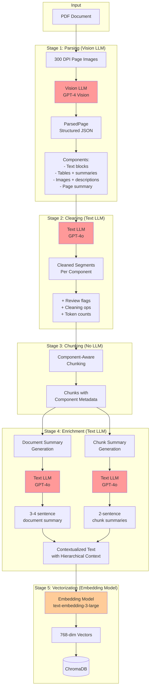

# LLM Integration Patterns

This document explains how Large Language Models (LLMs) are integrated throughout the RAG pipeline, covering architecture patterns, data flow, prompt management, and best practices.

---

## Table of Contents

1. [Overview](#overview)
2. [Architecture Pattern: Ports and Adapters](#architecture-pattern-ports-and-adapters)
3. [LLM Data Flow](#llm-data-flow)
4. [Integration Points](#integration-points)
5. [Prompt Management](#prompt-management)
6. [Structured Outputs](#structured-outputs)
7. [Error Handling and Fallbacks](#error-handling-and-fallbacks)
8. [Testing LLM Integrations](#testing-llm-integrations)

---

## Overview

The RAG pipeline uses LLMs at multiple stages to transform raw documents into semantically-rich, searchable content:

- **Parsing Stage**: Vision LLM extracts structured components (text, tables, images) from PDF pages
- **Cleaning Stage**: Text LLM normalizes content and flags segments for human review
- **Enrichment Stage**: Text LLM generates summaries at document and chunk levels

All LLM integrations follow hexagonal architecture principles, isolating LLM concerns to the adapter layer while keeping business logic clean and testable.

---

## Architecture Pattern: Ports and Adapters

### Separation of Concerns

```
┌─────────────────────────────────────────────────────────────┐
│                     APPLICATION LAYER                        │
│  ┌──────────────┐  ┌──────────────┐  ┌──────────────┐      │
│  │   Parsing    │  │   Cleaning   │  │  Enrichment  │      │
│  │   Service    │  │   Service    │  │   Service    │      │
│  └──────┬───────┘  └──────┬───────┘  └──────┬───────┘      │
│         │                  │                  │              │
│         │ depends on       │ depends on       │ depends on  │
│         ▼ interfaces       ▼ interfaces       ▼ interfaces  │
│  ┌──────────────┐  ┌──────────────┐  ┌──────────────┐      │
│  │  ParsingLLM  │  │ CleaningLLM  │  │   Summary    │      │
│  │   Protocol   │  │   Protocol   │  │  Generator   │      │
│  │  (interface) │  │  (interface) │  │   Protocol   │      │
│  └──────────────┘  └──────────────┘  └──────────────┘      │
└─────────────────────────────────────────────────────────────┘
                            │
                            │ implemented by
                            ▼
┌─────────────────────────────────────────────────────────────┐
│                      ADAPTER LAYER                           │
│  ┌──────────────────┐  ┌──────────────────┐  ┌──────────┐  │
│  │  ImageAware      │  │   Cleaning       │  │ LlamaIndex│  │
│  │ ParsingAdapter   │  │    Adapter       │  │  Summary  │  │
│  │                  │  │                  │  │  Adapter  │  │
│  │ - Vision LLM     │  │ - Text LLM       │  │           │  │
│  │ - Structured out │  │ - Structured out │  │ - Text LLM│  │
│  └──────────────────┘  └──────────────────┘  └──────────┘  │
└─────────────────────────────────────────────────────────────┘
                            │
                            │ uses
                            ▼
┌─────────────────────────────────────────────────────────────┐
│                   INFRASTRUCTURE LAYER                       │
│  ┌──────────────────────────────────────────────────────┐   │
│  │         LlamaIndex Client (Shared LLM Instance)      │   │
│  │  - OpenAI GPT-4 Vision (parsing)                     │   │
│  │  - OpenAI GPT-4o (text processing)                   │   │
│  └──────────────────────────────────────────────────────┘   │
└─────────────────────────────────────────────────────────────┘
```

### Key Benefits

1. **Testability**: Services can be tested with stub adapters that don't call real LLMs
2. **Swappability**: Can switch from OpenAI to Anthropic/Gemini by changing adapters only
3. **Cost Control**: Easy to track LLM usage per adapter, implement rate limiting, caching
4. **Observability**: Adapter layer is the natural place to add tracing and metrics

---

## LLM Data Flow

The following diagram shows how document data flows through LLM-powered stages:



### Data Transformations

| Stage | Input | LLM Used | Output | Key Benefit |
|-------|-------|----------|--------|-------------|
| **Parsing** | Page pixmap (image) | GPT-4 Vision | `ParsedPage` with components | Understands visual layout, extracts tables accurately |
| **Cleaning** | Parsed components | GPT-4o | Cleaned text segments + review flags | Normalizes formatting, identifies problematic content |
| **Enrichment (Doc)** | All page summaries | GPT-4o | 3-4 sentence document summary | Captures overall document purpose and scope |
| **Enrichment (Chunk)** | Chunk text + context | GPT-4o | 2-sentence chunk summary | Explains chunk content in relation to document |
| **Vectorization** | Contextualized text | text-embedding-3-large | 768-dim vector | Enables semantic search with hierarchical context |

---

## Integration Points

### 1. Parsing Stage: ImageAwareParsingAdapter

**Location**: `src/app/adapters/llama_index/parsing_adapter.py`

**Interface**: `ParsingLLM` protocol

**Purpose**: Extract structured content from PDF page images using vision LLM

**Code Pattern**:

```python
from llama_index.core.multi_modal_llms import MultiModalLLM
from ...parsing.schemas import ParsedPage

class ImageAwareParsingAdapter:
    def __init__(self, llm, vision_llm: MultiModalLLM, prompt_settings):
        self._vision_llm = vision_llm
        self._system_prompt = load_prompt("docs/prompts/parsing/system.md")
        self._user_prompt = load_prompt("docs/prompts/parsing/user.md")
    
    def parse_page(self, *, document_id, page_number, raw_text, pixmap_path) -> ParsedPage:
        # Use structured output to ensure valid ParsedPage JSON
        structured_llm = self._vision_llm.as_structured_llm(ParsedPage)
        
        messages = [
            ChatMessage(role="system", content=self._system_prompt),
            ChatMessage(role="user", content=[
                ImageBlock(image=pixmap_path),
                TextBlock(text=self._user_prompt)
            ])
        ]
        
        response = structured_llm.chat(messages)
        return response.raw  # Already a validated ParsedPage!
```

**Why Vision LLM?**
- Tables often have complex visual layouts that text extraction misses
- Images/diagrams provide crucial context
- Headers/footers can be identified by position
- Multi-column layouts are understood correctly

**Prompt**: See `docs/prompts/parsing/` for system and user prompts.

---

### 2. Cleaning Stage: CleaningAdapter

**Location**: `src/app/adapters/llama_index/cleaning_adapter.py`

**Interface**: `CleaningLLM` protocol

**Purpose**: Normalize parsed content and flag segments needing human review

**Code Pattern**:

```python
from llama_index.core.llms import LLM
from ...parsing.schemas import CleanedPage

class CleaningAdapter:
    def __init__(self, llm: LLM, prompt_settings):
        self._llm = llm
        self._system_prompt = load_prompt("docs/prompts/cleaning/system.md")
        self._user_prompt = load_prompt("docs/prompts/cleaning/user.md")
    
    def clean_page(self, parsed_page: ParsedPage, pixmap_path=None) -> CleanedPage:
        # Use structured output for reliable CleanedPage JSON
        structured_llm = self._llm.as_structured_llm(CleanedPage)
        
        # Format parsed components as text
        context = self._format_parsed_page(parsed_page)
        
        messages = [
            ChatMessage(role="system", content=self._system_prompt),
            ChatMessage(role="user", content=self._user_prompt.format(context=context))
        ]
        
        response = structured_llm.chat(messages)
        return response.raw  # Validated CleanedPage with review flags
```

**What Gets Cleaned?**
- Whitespace normalization
- OCR artifacts (e.g., `l i k e  t h i s` → `like this`)
- Header/footer removal
- Page number removal
- Redundant line breaks

**Review Flags**: LLM sets `needs_review=True` for segments with:
- Garbled text that might be important
- Potential OCR errors in technical content
- Ambiguous formatting

**Prompt**: See `docs/prompts/cleaning/` for system and user prompts.

---

### 3. Enrichment Stage: LlamaIndexSummaryAdapter

**Location**: `src/app/adapters/llama_index/summary_adapter.py`

**Interface**: `SummaryGenerator` protocol

**Purpose**: Generate summaries at document and chunk levels using hierarchical context

#### Document Summary Generation

**Code Pattern**:

```python
from llama_index.core.llms import LLM
from typing import Sequence

class LlamaIndexSummaryAdapter:
    def __init__(self, llm: LLM, prompt_settings):
        self._llm = llm
        self._document_summary_prompt = load_prompt("docs/prompts/summarization/document_summary.md")
    
    def summarize_document(
        self,
        filename: str,
        file_type: str,
        page_count: int,
        page_summaries: Sequence[tuple[int, str]],
    ) -> str:
        # Format input for LLM
        formatted_summaries = "\n\n".join(
            f"**Page {page_num}**: {summary}" 
            for page_num, summary in page_summaries
        )
        
        user_content = f"""Document: {filename}
File Type: {file_type}
Total Pages: {page_count}

Page Summaries:
{formatted_summaries}
"""
        
        completion = self._llm.complete(f"{self._document_summary_prompt}\n\n{user_content}")
        return extract_response_text(completion).strip()
```

**Output**: 3-4 sentence summary capturing:
1. Document type and purpose
2. Main topics covered
3. Key entities or standards mentioned
4. Overall scope and audience

#### Chunk Summary Generation

**Code Pattern**:

```python
class LlamaIndexSummaryAdapter:
    def __init__(self, llm: LLM, prompt_settings):
        self._llm = llm
        self._chunk_summary_prompt = load_prompt("docs/prompts/summarization/chunk_summary.md")
    
    def summarize_chunk(
        self,
        chunk_text: str,
        document_title: str,
        document_summary: str,
        page_summary: str | None,
        component_type: str | None,
    ) -> str:
        # Provide hierarchical context to LLM
        user_content = f"""Context:
- Document title: {document_title}
- Document summary: {document_summary}
- Page summary: {page_summary or 'N/A'}
- Component type: {component_type or 'text'}

Chunk Text:
{chunk_text}
"""
        
        completion = self._llm.complete(f"{self._chunk_summary_prompt}\n\n{user_content}")
        return extract_response_text(completion).strip()
```

**Output**: 2-sentence summary:
1. **First sentence**: What specific information this chunk contains
2. **Second sentence**: How it relates to the document's purpose

**Prompts**: See `docs/prompts/summarization/` for document and chunk summary prompts.

---

## Prompt Management

All LLM prompts are stored as **markdown files** under `docs/prompts/`, organized by stage:

```
docs/prompts/
├── README.md                          # Prompt tuning guide
├── parsing/
│   ├── system.md                      # Vision LLM system instructions
│   └── user.md                        # Vision LLM user message template
├── cleaning/
│   ├── system.md                      # Cleaning LLM system instructions
│   └── user.md                        # Cleaning LLM user message template
└── summarization/
    ├── system.md                      # (generic, for backward compatibility)
    ├── document_summary.md            # Document-level summary instructions
    └── chunk_summary.md               # Chunk-level summary instructions
```

### Loading Prompts

```python
from src.app.prompts.loader import load_prompt

# Load a prompt file
system_prompt = load_prompt("docs/prompts/parsing/system.md")
```

### Prompt Tuning Workflow

1. **Edit prompt file** in `docs/prompts/`
2. **Test changes** by running a pipeline stage (ingestion → parsing → enrichment)
3. **Compare results** before/after using the dashboard's document viewer
4. **Commit changes** with a descriptive message

See [`docs/prompts/README.md`](prompts/README.md) for detailed tuning guide with examples.

---

## Structured Outputs

All LLM-powered adapters use **structured outputs** via LlamaIndex's `as_structured_llm()` method to ensure reliable JSON extraction.

### Why Structured Outputs?

**Problem**: LLM responses can include extra text, formatting, or invalid JSON:

```
Here's the parsed page:

{
  "components": [...]
}

Let me know if you need any clarification!
```

**Solution**: Use `as_structured_llm()` to constrain the LLM to output only valid JSON matching a Pydantic schema:

```python
from llama_index.core.llms import LLM
from pydantic import BaseModel

class ParsedPage(BaseModel):
    components: list[Component]
    page_summary: str

# Wrap LLM with structured output
structured_llm = llm.as_structured_llm(ParsedPage)

# Response is guaranteed to be a valid ParsedPage instance
response = structured_llm.chat(messages)
parsed_page = response.raw  # Already validated!
```

### Schemas Used

| Stage | Schema | Location |
|-------|--------|----------|
| Parsing | `ParsedPage` | `src/app/parsing/schemas.py` |
| Cleaning | `CleanedPage` | `src/app/parsing/schemas.py` |

**Note**: Summarization does **not** use structured outputs because the response is plain text (no JSON).

### Benefits

- **Reliability**: No need to parse JSON manually or handle malformed responses
- **Validation**: Pydantic ensures all required fields are present and typed correctly
- **Developer Experience**: Type hints work in IDEs, reducing bugs

See [`docs/Structured_Output_Implementation_Summary.md`](Structured_Output_Implementation_Summary.md) for full implementation details.

---

## Error Handling and Fallbacks

All LLM integrations include **fallback logic** to handle LLM failures gracefully:

### Parsing Adapter

```python
def parse_page(self, *, document_id, page_number, raw_text, pixmap_path) -> ParsedPage:
    try:
        structured_llm = self._vision_llm.as_structured_llm(ParsedPage)
        response = structured_llm.chat(messages)
        return response.raw
    except Exception as exc:
        logger.warning("Vision LLM parsing failed, falling back to text-only: %s", exc)
        # Fallback: treat entire page as single text component
        return ParsedPage(
            components=[
                Component(type="text", text_type="paragraph", text=raw_text)
            ],
            page_summary=raw_text[:200]
        )
```

### Cleaning Adapter

```python
def clean_page(self, parsed_page: ParsedPage, pixmap_path=None) -> CleanedPage:
    try:
        structured_llm = self._llm.as_structured_llm(CleanedPage)
        response = structured_llm.chat(messages)
        return response.raw
    except Exception as exc:
        logger.warning("LLM cleaning failed, using heuristic fallback: %s", exc)
        # Fallback: apply simple whitespace normalization
        return self._heuristic_cleaning(parsed_page)
```

### Summary Adapter

```python
def summarize_document(self, filename, file_type, page_count, page_summaries) -> str:
    try:
        completion = self._llm.complete(f"{prompt}\n\n{context}")
        return extract_response_text(completion).strip()
    except Exception as exc:
        logger.warning("Document summary generation failed: %s", exc)
        # Fallback: concatenate page summaries
        return " ".join(s for _, s in page_summaries)[:500]
```

### Design Principle

**LLM failures should degrade quality, not break the pipeline.**

- Parsing failure → Use raw text (no tables/images)
- Cleaning failure → Use heuristic cleaning (regex-based)
- Summary failure → Use truncation or concatenation

This ensures the pipeline can process documents even if the LLM is unavailable or rate-limited.

---

## Testing LLM Integrations

### Unit Tests with Stubs

Services depend on **protocols**, not concrete adapters, enabling test stubs:

```python
class StubSummaryGenerator:
    def summarize(self, text: str) -> str:
        return "stub-summary"
    
    def summarize_document(self, filename, file_type, page_count, page_summaries) -> str:
        return "stub-document-summary"
    
    def summarize_chunk(self, chunk_text, document_title, document_summary, 
                       page_summary, component_type) -> str:
        return "stub-chunk-summary"

# Inject stub into service
enrichment = EnrichmentService(
    observability=observability,
    summary_generator=StubSummaryGenerator(),
    use_llm_summarization=True
)

# Test without calling real LLM
document = enrichment.enrich(chunked_document)
assert document.summary == "stub-document-summary"
```

### Integration Tests with Real LLMs

For end-to-end validation, tests can use real LLM adapters:

```python
def test_parsing_with_real_llm():
    """Integration test with real OpenAI API (requires API key)."""
    llm, vision_llm = bootstrap_llama_index()
    adapter = ImageAwareParsingAdapter(llm, vision_llm, prompt_settings)
    
    parsed_page = adapter.parse_page(
        document_id="test-doc",
        page_number=1,
        raw_text="...",
        pixmap_path="/path/to/page.png"
    )
    
    assert parsed_page.components
    assert parsed_page.page_summary
```

**Best Practice**: Run integration tests in CI only if `OPENAI_API_KEY` is set, otherwise skip.

### Contract Tests

**Contract tests** verify that LLM responses match expected schemas without calling the LLM:

```python
def test_parsed_page_schema_is_valid():
    """Ensure ParsedPage schema can be constructed from sample JSON."""
    sample_json = {
        "components": [
            {"type": "text", "text_type": "paragraph", "text": "Sample text"}
        ],
        "page_summary": "This is a summary"
    }
    
    parsed_page = ParsedPage(**sample_json)
    assert parsed_page.components[0].text == "Sample text"
```

See `tests_contracts/test_openai_contracts.py` for examples.

---

## Summary

| **Aspect** | **Details** |
|------------|-------------|
| **Architecture** | Hexagonal (ports & adapters) isolates LLM concerns to adapter layer |
| **Stages** | Parsing (vision LLM), Cleaning (text LLM), Enrichment (text LLM), Vectorization (embedding model) |
| **Prompts** | Stored as markdown files in `docs/prompts/`, loaded at runtime |
| **Structured Outputs** | Used for parsing and cleaning to ensure valid JSON |
| **Error Handling** | All adapters have fallbacks (text-only parsing, heuristic cleaning, truncated summaries) |
| **Testing** | Protocols enable stub-based unit tests; real LLMs used for integration tests |

---

## Next Steps

- **Observability**: Integrate [Langfuse](https://langfuse.com/) to trace LLM calls, track token usage, and version prompts
- **Prompt Optimization**: Use [DSPy](https://github.com/stanfordnlp/dspy) or [PromptFoo](https://www.promptfoo.dev/) for automated prompt tuning
- **Evaluation**: Add [Ragas](https://docs.ragas.io/) for RAG evaluation (context precision, answer relevance)
- **Caching**: Cache LLM responses (especially parsing) to reduce costs on repeated pipeline runs

See [`Observability_Integration_TODO.md`](Observability_Integration_TODO.md) for full roadmap.

---

## Related Documentation

- [`ARCHITECTURE.md`](ARCHITECTURE.md) - Overall system architecture
- [`docs/prompts/README.md`](prompts/README.md) - Prompt tuning guide
- [`Structured_Output_Implementation_Summary.md`](Structured_Output_Implementation_Summary.md) - Structured output deep dive
- [`Pipeline_Quick_Reference.md`](Pipeline_Quick_Reference.md) - Pipeline data flow cheat sheet

