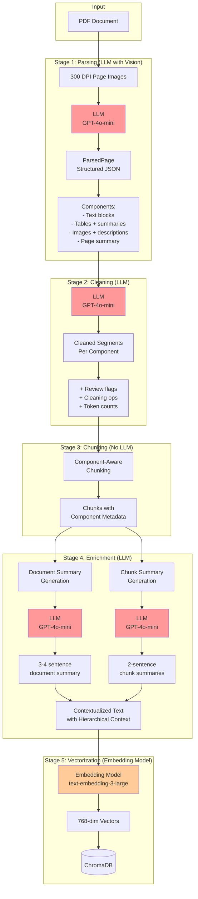

# RAG Pipeline: Quick Reference Guide

A cheat sheet for understanding data flow, storage locations, and key concepts in the RAG pipeline.

## Processing Modes

The pipeline supports two processing modes:

**Single Document Mode**: Sequential processing through all stages with real-time progress tracking  
**Batch Processing Mode**: Concurrent processing of multiple documents with multi-level parallelism

---

## Visual Overview: LLM-Powered Data Flow

The following diagram shows how document data flows through LLM-powered pipeline stages:



**Key Points**:
- **Red nodes** = LLM-powered transformations (parsing, cleaning, summarization) - all use the same LLM (GPT-4o-mini) with vision capabilities
- **Orange nodes** = Embedding model (not a generative LLM, but still AI-powered)
- **White nodes** = Data or rule-based processing (no AI)

For detailed information on LLM integration patterns, see [`LLM_Integration_Patterns.md`](LLM_Integration_Patterns.md).

---

## Pipeline Stages: Data In → Data Out

### 1. Ingestion
```
IN:  Raw file bytes + basic Document metadata
OUT: Document with status="ingested"
     + document.metadata.raw_file_path (where bytes are stored)
     + document.metadata.raw_file_checksum (SHA-256)
     + document.metadata.ingested_at (timestamp)
```

### 2. Parsing
```
IN:  Ingested document + file bytes
OUT: Document with pages[], status="parsed"
     + page.text (raw text from pdfplumber)
     + document.metadata.parsed_pages (structured components from LLM with vision)
       - Each ParsedPage includes:
         * components[] (text, tables, images with metadata)
         * table_summary (for each table component)
         * page_summary (high-level page overview)
     + document.metadata.pixmap_assets (PNG images of pages at 300 DPI)
```

### 3. Cleaning
```
IN:  Parsed document with pages + parsed_pages metadata
OUT: Document with page.cleaned_text, status="cleaned"
     + page.cleaned_text (normalized text)
     + document.metadata.cleaning_metadata_by_page (cleaning reports + LLM segments)
     + llm_segments.segments[] (with needs_review flags)
```

### 4. Chunking
```
IN:  Cleaned document with pages
OUT: Document with page.chunks[], status="chunked"
     + chunk.text (raw chunk slice)
     + chunk.cleaned_text (cleaned chunk slice)
     + chunk.metadata.component_type (text/table/image)
     + chunk.metadata.component_id (links to parsed component)
     + chunk.metadata.component_summary (for tables)
     + chunk.metadata.component_description (for images)
     + chunk.metadata.extra.cleaning (attached from stage 3)
     
Strategy: component (default) | hybrid | fixed
- component: Preserves table/image boundaries, groups small components
- hybrid: Mix of component-aware and fixed-size
- fixed: Legacy overlapping windows
```

### 5. Enrichment
```
IN:  Chunked document
OUT: Document with chunk summaries + document summary, status="enriched"
     + chunk.metadata.summary (LLM-generated 2-3 sentence summary)
     + chunk.contextualized_text (with hierarchical context prefix)
       Format: "[Document: X | Page: Y | Section: Z | Type: T]\n\nchunk_text"
     + chunk.metadata.document_title
     + chunk.metadata.document_summary (LLM-generated from page summaries)
     + chunk.metadata.page_summary
     + chunk.metadata.section_heading (extracted from parsed components)
     + document.summary (LLM-generated 3-4 sentence overview from page summaries)
```

### 6. Vectorization
```
IN:  Enriched document
OUT: Document with vectors, status="vectorized"
     + chunk.metadata.extra.vector (embedding of contextualized_text, not raw text)
     + chunk.metadata.extra.used_contextualized_text (true/false flag)
     + document.metadata.vector_samples (sample vectors for debugging)
     + document.metadata.vector_dimension (e.g., 1536 for OpenAI)
     
Note: Embeds contextualized_text for better retrieval, preserves cleaned_text for generation
```

---

## Storage Locations

### Single Document Processing

| Path | Contains | When Created |
|------|----------|--------------|
| `artifacts/ingestion/<doc_id>/<timestamp>_<filename>` | Raw file bytes | Ingestion stage |
| `artifacts/pixmaps/<doc_id>/page_N.png` | Page images (300 DPI) | Parsing stage |
| `artifacts/documents/<doc_id>.json` | **Final processed document** | After pipeline completion |
| `artifacts/runs/<run_id>/run.json` | Run metadata (status, timestamps, stage order) | Run start |
| `artifacts/runs/<run_id>/document.json` | Document snapshot (same as canonical) | Run completion |
| `artifacts/runs/<run_id>/stages/parsing.json` | Parsing stage output details | After parsing |
| `artifacts/runs/<run_id>/stages/cleaning.json` | Cleaning stage output details | After cleaning |
| `artifacts/runs/<run_id>/stages/vectorization.json` | Sample vectors only | After vectorization |

### Batch Processing

| Path | Contains | When Created |
|------|----------|--------------|
| `artifacts/batches/<batch_id>/batch.json` | Batch metadata (status, progress, document count) | Batch creation |
| `artifacts/batches/<batch_id>/documents/<doc_id>.json` | Individual document job status and progress | Per document |

**Key Insight**: `artifacts/documents/<doc_id>.json` and `artifacts/runs/<run_id>/document.json` contain the **same document data**. The runs directory adds execution context. Batch processing creates additional tracking artifacts under `artifacts/batches/`.

---

## LLM Integration Points

### Parsing (LLM with Vision)
- **Adapter**: `ImageAwareParsingAdapter`
- **Prompts**: `docs/prompts/parsing/system.md` + `user.md`
- **Input**: Page image (PNG) + optional raw text
- **Output**: `ParsedPage` (components array with text, images, tables)
- **Stored in**: `document.metadata.parsed_pages[page_num]`
- **Note**: Uses the same LLM (GPT-4o-mini) configured for all stages, with vision capabilities enabled

### Cleaning (LLM)
- **Adapter**: `CleaningAdapter`
- **Prompts**: `docs/prompts/cleaning/system.md` + `user.md`
- **Input**: `ParsedPage.components` array (from parsing)
- **Output**: `CleanedPage` (segments with needs_review flags)
- **Stored in**: `document.metadata.cleaning_metadata_by_page[page_num].llm_segments`

### Enrichment (LLM)
- **Adapter**: `LlamaIndexSummaryAdapter` ✅ Implemented
- **Prompts**: `docs/prompts/summarization/system.md`
- **Input**: 
  - Page summaries (for document summary)
  - Chunk text + hierarchical context (for chunk summary)
  - Chunk text + context (for contextualized text generation)
- **Output**: 
  - Document summary (3-4 sentences from page summaries)
  - Chunk summary (2-3 sentences)
  - Contextualized text with context prefix
- **Stored in**: 
  - `document.summary`
  - `chunk.metadata.summary`
  - `chunk.contextualized_text`

---

## Key Data Structures

### Document
```json
{
  "id": "uuid",
  "filename": "doc.pdf",
  "status": "vectorized",
  "summary": "Document-level summary (280 chars max)",
  "pages": [...],
  "metadata": {
    "raw_file_path": "...",
    "parsed_pages": {...},
    "cleaning_metadata_by_page": {...},
    "vector_dimension": 1536
  }
}
```

### Page
```json
{
  "id": "uuid",
  "page_number": 1,
  "text": "Raw text from pdfplumber",
  "cleaned_text": "Normalized text from cleaning stage",
  "chunks": [...]
}
```

### Chunk
```json
{
  "id": "uuid",
  "text": "Raw chunk slice",
  "cleaned_text": "Cleaned chunk slice",
  "start_offset": 0,
  "end_offset": 507,
  "metadata": {
    "chunk_id": "uuid",
    "title": "doc.pdf-p1-c0",
    "summary": "2-sentence summary from enrichment",
    "extra": {
      "cleaning": {
        "llm_segments": {...}
      },
      "vector": [0.1, 0.2, ...]
    }
  }
}
```

### ParsedPage (in metadata)
```json
{
  "document_id": "uuid",
  "page_number": 1,
  "raw_text": "Full markdown representation",
  "components": [
    {
      "type": "text",
      "id": "1",
      "order": 0,
      "text": "Component text",
      "text_type": "heading"
    },
    {
      "type": "image",
      "id": "2",
      "order": 1,
      "description": "Visual description",
      "recognized_text": "OCR text from image"
    },
    {
      "type": "table",
      "id": "3",
      "order": 2,
      "rows": [{...}],
      "caption": "Table title"
    }
  ]
}
```

### CleanedPage (in metadata)
```json
{
  "document_id": "uuid",
  "page_number": 1,
  "segments": [
    {
      "segment_id": "5",
      "text": "Cleaned segment text",
      "needs_review": true,
      "rationale": "Contact information should be verified"
    }
  ]
}
```

---

## Component-Aware Chunking Strategies

### When to Use Each Strategy

| Strategy | Best For | Pros | Cons |
|----------|----------|------|------|
| `component` (default) | Technical docs with tables/diagrams | Preserves structure, semantic boundaries | May create uneven chunk sizes |
| `hybrid` | Mixed content documents | Balance of structure and consistency | More complex configuration |
| `fixed` | Plain text documents | Consistent chunk sizes | May break tables/code blocks |

### Component Strategy Details

**How it works:**

1. **Small components** (< 100 tokens): Group together
   - Example: Short paragraphs merged into single chunk
   
2. **Medium components** (100-500 tokens): Keep as-is
   - Example: One table = one chunk
   
3. **Large components** (> 500 tokens): Split at sentence boundaries
   - Example: Long section split into multiple chunks

**Configuration:**

```bash
CHUNKING__STRATEGY=component
CHUNKING__COMPONENT_MERGE_THRESHOLD=100  # Min tokens to merge
CHUNKING__MAX_COMPONENT_TOKENS=500      # Max before splitting
```

**Metadata attached to each chunk:**

- `component_type`: "text", "table", or "image"
- `component_id`: UUID linking to original parsed component
- `component_summary`: Table summary (for table chunks)
- `component_description`: Image description (for image chunks)
- `component_order`: Position in original page

---

## Contextualized Text Format

Following Anthropic's contextual retrieval pattern, chunks are enriched with hierarchical context before embedding.

### Structure

```
[Document: {document_title} | Page: {page_num} | Section: {section_heading} | Type: {component_type}]

{chunk.cleaned_text}
```

### Example

```
[Document: Aircraft_Manual.pdf | Page: 12 | Section: Propulsion System | Type: table]

Propeller Specifications:
- Diameter: 72 inches
- Pitch: 24 degrees
- Material: Carbon composite
```

### Why This Matters

**Without context:**
- Embedding just "Propeller pitch: 24 degrees" loses document context
- Query "What's the propeller pitch?" may retrieve wrong document

**With context:**
- Embedding includes document, page, and section info
- Better disambiguation across multi-document corpus
- Improved ranking for context-aware queries

### Storage

- `chunk.contextualized_text`: Used for embedding (retrieval)
- `chunk.cleaned_text`: Used for generation (avoid hallucinated context)
- Both preserved in `document.json`

---

## Batch Processing Features

### Multi-Level Parallelism

**Document-Level**: Process up to 5 documents concurrently (configurable)
**Page-Level**: Within each document, parse and clean pages in parallel
**Pixmap-Level**: Render PDF pages in parallel using process pools (3-5x speedup)

### Configuration

```bash
BATCH__MAX_CONCURRENT_DOCUMENTS=5      # Max documents in parallel
BATCH__MAX_WORKERS_PER_DOCUMENT=4      # Max workers per document
BATCH__ENABLE_PAGE_PARALLELISM=true    # Enable page parallelism
BATCH__RATE_LIMIT_REQUESTS_PER_MINUTE=60  # API rate limiting
```

### Batch API Endpoints

- `POST /batch/upload` - Upload multiple files (up to 50)
- `GET /batch/{batch_id}` - Get batch status with per-document progress
- `GET /batch/{batch_id}/stream` - Real-time SSE progress updates
- `GET /batch/` - List recent batches
- `GET /batch-dashboard/` - Interactive batch monitoring UI

### Batch Observability

Clean, minimal logging with Langfuse integration:
```
12:34:56.789 | [PIXMAP_PAGE_COMPLETE] batch=8fbc27f6 doc=test.pdf page=1/10
12:35:00.234 | [PARSING] batch=8fbc27f6 doc=test.pdf 10 pages
12:35:05.678 | [CLEANING] batch=8fbc27f6 doc=test.pdf 10 pages
12:35:15.789 | [PIPELINE_COMPLETE] batch=8fbc27f6 doc=test.pdf ⏱ 18789ms
```

Enable Langfuse tracing:
```bash
LANGFUSE__ENABLED=true
LANGFUSE__PUBLIC_KEY=pk-lf-...
LANGFUSE__SECRET_KEY=sk-lf-...
```

---

## Common Questions

### Q: Why do I see only one chunk per page?
**A**: The entire page text fits within the chunk size (default 200 tokens). Either:
- The page is short (< 200 tokens)
- Or you need to reduce `chunk_size` for finer granularity

### Q: Where are the vectors?
**A**: In two places:
1. Full vectors: `chunk.metadata.extra.vector` (in document.json)
2. Samples: `artifacts/runs/<run_id>/stages/vectorization.json` (first 3 chunks only)

### Q: What's the difference between page.text and page.cleaned_text?
**A**:
- `page.text`: Raw extraction from pdfplumber (may have extra whitespace, formatting issues)
- `page.cleaned_text`: Normalized by cleaning LLM (better grammar, spacing)

### Q: Where are the LLM segment breakdowns?
**A**: In `document.metadata.cleaning_metadata_by_page[page_num].llm_segments.segments[]`

Also copied to: `chunk.metadata.extra.cleaning.llm_segments.segments[]` during chunking

### Q: How do I find segments that need human review?
**A**: Filter segments where `needs_review == true`:
```python
for page_num, meta in document.metadata["cleaning_metadata_by_page"].items():
    segments = meta["llm_segments"]["segments"]
    flagged = [s for s in segments if s.get("needs_review")]
    for seg in flagged:
        print(f"Page {page_num}, Segment {seg['segment_id']}: {seg['rationale']}")
```

### Q: Why is the document summary different from chunk summaries?
**A**: Document summary is LLM-generated from all page summaries (not chunk summaries). This ensures it captures content from all pages, not just the first page.

### Q: How do I change what gets flagged for review?
**A**: Edit `docs/prompts/cleaning/system.md` to add/remove criteria for flagging segments.

### Q: Can I change the chunking strategy?
**A**: Yes, set the strategy in config or environment:
```bash
CHUNKING__STRATEGY=component  # or "hybrid" or "fixed"
CHUNKING__COMPONENT_MERGE_THRESHOLD=100
CHUNKING__MAX_COMPONENT_TOKENS=500
```
For fixed-size chunking:
```bash
CHUNKING__STRATEGY=fixed
CHUNKING__CHUNK_SIZE=512
CHUNKING__CHUNK_OVERLAP=50
```

---

## Prompt Tuning Quick Guide

### To improve parsing quality:
1. Edit `docs/prompts/parsing/system.md` (behavior directives)
2. Edit `docs/prompts/parsing/user.md` (output schema and examples)
3. Re-run pipeline on test document
4. Compare `document.metadata.parsed_pages` before/after

### To improve cleaning quality:
1. Edit `docs/prompts/cleaning/system.md` (cleaning rules and review criteria)
2. Edit `docs/prompts/cleaning/user.md` (input format explanation)
3. Re-run pipeline on test document
4. Compare `page.cleaned_text` and `llm_segments` before/after

### To improve summaries:
1. Edit `docs/prompts/summarization/system.md` (summarization style)
2. Implement `LLMSummaryAdapter` (currently not wired)
3. Wire adapter in `container.py`
4. Re-run pipeline on test document
5. Compare `chunk.metadata.summary` before/after

---

## Observability Checklist

### Current State
- ✅ Basic logging via `LoggingObservabilityRecorder`
- ✅ Stage timing captured in `PipelineStage` objects
- ❌ No LLM call tracing (prompts, responses, tokens)
- ❌ No quality metrics (faithfulness, relevance)
- ❌ No cost tracking
- ❌ No query-time observability

### After Langfuse Integration
- ✅ Full LLM call tracing (automatic via callback handler)
- ✅ Hierarchical spans (pipeline → stage → LLM call)
- ✅ Token and cost tracking
- ✅ Prompt versioning
- ✅ Links between document processing and LLM operations

### After Ragas Integration
- ✅ Faithfulness scores (no hallucination)
- ✅ Answer relevancy scores
- ✅ Context precision (retrieved chunks are relevant)
- ✅ Context recall (all relevant chunks retrieved)
- ✅ Quality regression tests in CI
- ✅ Continuous quality monitoring

---

## Debug Workflow

### Problem: Document summary is wrong
1. Check `document.summary` in `artifacts/documents/<doc_id>.json`
2. Check all `chunk.metadata.summary` values
3. Check if enrichment is using LLM or truncation (`EnrichmentService._summarize_chunk`)
4. Check `docs/prompts/summarization/system.md`
5. Check document-level summary logic in `EnrichmentService.enrich()` (line 54-56)

### Problem: Cleaning produced bad text
1. Check `page.cleaned_text` vs. `page.text` in document.json
2. Check `document.metadata.cleaning_metadata_by_page[N].llm_segments.segments`
3. Look for segments with `needs_review=true` and their rationales
4. Review `docs/prompts/cleaning/system.md` and `user.md`
5. Check if cleaning LLM is enabled (should be `CleaningAdapter` in container)

### Problem: Parsing missed content
1. Check `document.metadata.parsed_pages[N].components` array
2. Look for missing components (text, images, tables)
3. Check `document.metadata.parsed_pages[N].raw_text` (markdown representation)
4. Review `docs/prompts/parsing/system.md` (especially image extraction directives)
5. Check pixmap quality in `artifacts/pixmaps/<doc_id>/page_N.png`
6. Check if LLM parsing is enabled (`ImageAwareParsingAdapter` in container)

### Problem: Chunks are too large/small
1. Check current chunk size: `ChunkingService.chunk_size` (default 200)
2. Count tokens in chunks: `len(chunk.text.split())`
3. Adjust size in container or pass as parameter
4. Consider semantic chunking if fixed-size doesn't work well

### Problem: No vectors in document
1. Check `document.status` (should be "vectorized")
2. Check `chunk.metadata.extra.vector` (should be list of floats)
3. Check `document.metadata.vector_dimension` (should match embedder)
4. Check if vectorization service is wired in container
5. Check if embedder is configured (currently uses deterministic placeholder)

---

## System Prompt Locations

| Stage | System Prompt | User Prompt |
|-------|---------------|-------------|
| Parsing | `docs/prompts/parsing/system.md` | `docs/prompts/parsing/user.md` |
| Cleaning | `docs/prompts/cleaning/system.md` | `docs/prompts/cleaning/user.md` |
| Enrichment | `docs/prompts/summarization/system.md` | N/A (just chunk text) |

**Note**: Prompts are loaded at adapter initialization from files. Changes require restarting the service.

---

## Key Files to Know

| File | Purpose |
|------|---------|
| `src/app/services/pipeline_runner.py` | Orchestrates all stages, creates PipelineResult |
| `src/app/services/parsing_service.py` | Page extraction + LLM parsing with vision |
| `src/app/services/cleaning_service.py` | Text normalization + segment flagging |
| `src/app/services/chunking_service.py` | Fixed-size chunk splitting |
| `src/app/services/enrichment_service.py` | Chunk/document summarization |
| `src/app/services/vector_service.py` | Embedding generation |
| `src/app/adapters/llama_index/parsing_adapter.py` | LLM integration with vision capabilities |
| `src/app/adapters/llama_index/cleaning_adapter.py` | Cleaning LLM integration |
| `src/app/container.py` | Dependency injection, wiring |
| `src/app/domain/models.py` | Document, Page, Chunk, Metadata schemas |
| `src/app/parsing/schemas.py` | ParsedPage, CleanedPage schemas |

---

## Useful Snippets

### Load and inspect a document
```python
import json
from pathlib import Path

# Load canonical document
doc_path = Path("artifacts/documents/<doc_id>.json")
doc = json.loads(doc_path.read_text())

print(f"Status: {doc['status']}")
print(f"Pages: {len(doc['pages'])}")
print(f"Summary: {doc['summary']}")

# Check chunks
for page in doc["pages"]:
    print(f"Page {page['page_number']}: {len(page['chunks'])} chunk(s)")
```

### Find flagged segments
```python
doc = json.loads(Path("artifacts/documents/<doc_id>.json").read_text())

for page_num, meta in doc["metadata"]["cleaning_metadata_by_page"].items():
    segments = meta["llm_segments"]["segments"]
    for seg in segments:
        if seg.get("needs_review"):
            print(f"Page {page_num}, Segment {seg['segment_id']}:")
            print(f"  Text: {seg['text'][:100]}...")
            print(f"  Rationale: {seg['rationale']}")
```

### Compare raw vs. cleaned text
```python
doc = json.loads(Path("artifacts/documents/<doc_id>.json").read_text())

for page in doc["pages"]:
    print(f"Page {page['page_number']}:")
    print(f"  Raw: {len(page['text'])} chars")
    print(f"  Cleaned: {len(page.get('cleaned_text', ''))} chars")
    print(f"  Diff: {len(page.get('cleaned_text', '')) - len(page['text'])} chars")
```

### Check LLM segments
```python
doc = json.loads(Path("artifacts/documents/<doc_id>.json").read_text())

parsed_pages = doc["metadata"]["parsed_pages"]
for page_num, parsed_page in parsed_pages.items():
    print(f"Page {page_num}: {len(parsed_page['components'])} components")
    for comp in parsed_page["components"]:
        print(f"  [{comp['order']}] {comp['type']}: {comp.get('text', comp.get('description', ''))[:50]}...")
```

---

---

**Questions?** See the [Architecture Guide](ARCHITECTURE.md) or ask the team!

